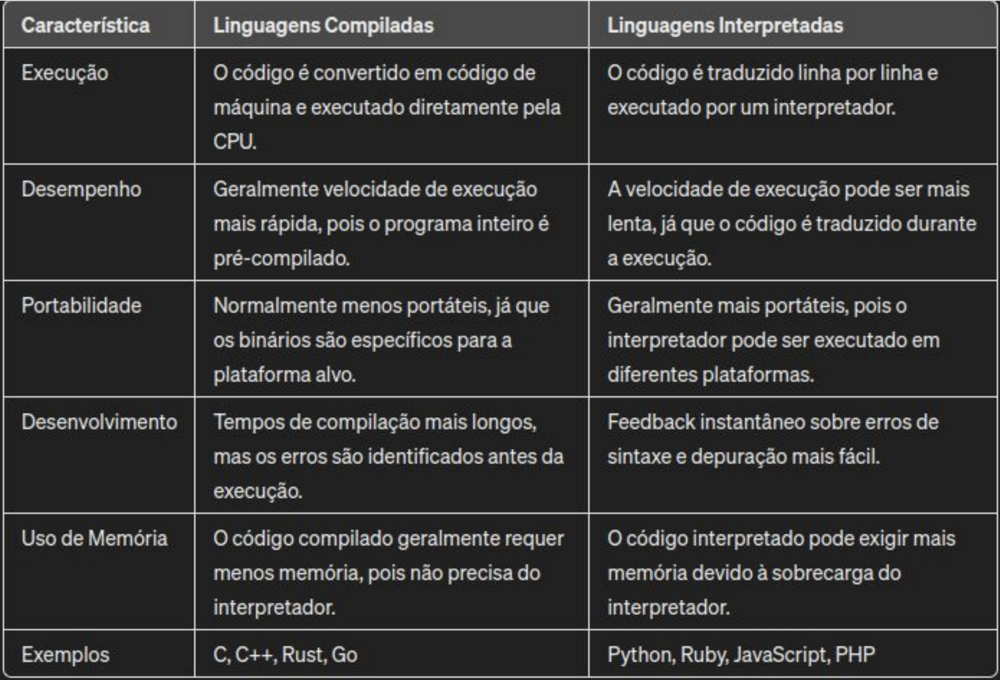

# segunda_aula

                                        **Aula do dia 15.04.2024**

# linguagens de alto nivel
- Mais próximos da linguagem humana
- O mesmo código executa em diferentes hardwares
- Python, Java, C#, JavaScript, Ruby

# Linguagens de baixo nivel
- Mais próximos da linguagem da máquina (mais dificil de entender a sintaxe)
- São dependentes do hardware progrmado
- Oferecem um maior controle sobre os recursos de baixo nivel (memória, processador)
- Muito desempenho
- Assembly

# Linguagens de proposito geral
- Uma ampla variedade de aplicação
- Mais versateis
- Mais usuários (programadores)
- Python, JavaScript e Ruby.

# Linguagens de dominio especifico
- Também chamadas de DSL (Domain Specific Languages) 
- Resolvem problemas em um domínio particular
- Otimizadas para lidar com tarefas específicas dentro de uma área especifica

# Frequentemente combinadas com linguagens de propósito geral
- SQL (banco de dados) 
- HTML/CSS (desenvolvimento web) 
- MATLAB (computação numérica) 
- VHDL (design de circuitos)

# Compilacao ou interpretacao



# Dinamicamente tipado
- São linguagens onde o valor da variavel definida pode ser alterada durante a execucao do programa 
- (e.g. Python, JS)

# Estaticamente tipada
- São linguagens onde o valor da variavel definida nao pode ser alterada durante a execucao do programa
- (e.g. C++ ou Java)

# Garbage collection (coleta de lixo)
- Mecanismo que esvazia a memória que não está mais sendo ultilizada para liberar mais espaço 
- Ajuda a evitar vazamentos de memória (memory leaks)
- Simplifica o uso de memória para os desenvolvedores.
- Usam garbage collection: Java, C#, Python e JavaScript
- Não usam garbage collection: C, C++, Rust


# Terminal 
- ls: lista os arquivos salvos
- nano test.py: abre o editor

```
>>> livia=21
>>> guilher=19
>>> felipe=19
>>> media = (livia + guiler + felipe)/3
Traceback (most recent call last):
  File "<stdin>", line 1, in <module>
NameError: name 'guiler' is not defined. Did you mean: 'guilher'?
>>> media = (felipe +guilher + felipe)/3
>>> 
>>> 
>>> 
>>> media = (felipe +guilher + felipe)/3
>>> media
19.0
>>> media= (felipe + livia + guilher) /3
>>> media
19.666666666666668
>>> 
>>> 
>>> 
>>> nano test.py
  File "<stdin>", line 1
    nano test.py
         ^^^^
SyntaxError: invalid syntax
>>> exit()
kauacastanho@neymar-jr ~ % nano test.py
kauacastanho@neymar-jr ~ % nano test.py
kauacastanho@neymar-jr ~ % nano test.py
kauacastanho@neymar-jr ~ % nano test.py
kauacastanho@neymar-jr ~ % nano test.py
kauacastanho@neymar-jr ~ % nano media.py
kauacastanho@neymar-jr ~ % ls           
Applications	Documents	Library		Music		Public
Desktop		Downloads	Movies		Pictures	media
kauacastanho@neymar-jr ~ % nano test.py 
kauacastanho@neymar-jr ~ % python test.py
zsh: command not found: python
kauacastanho@neymar-jr ~ % nano test.py  
kauacastanho@neymar-jr ~ % python test.py
zsh: command not found: python
kauacastanho@neymar-jr ~ % nano test.py
kauacastanho@neymar-jr ~ % python test.py
zsh: command not found: python
kauacastanho@neymar-jr ~ % nano test.py  
kauacastanho@neymar-jr ~ % python test.py
zsh: command not found: python
kauacastanho@neymar-jr ~ % nano test.py  
kauacastanho@neymar-jr ~ % python test.py
zsh: command not found: python
kauacastanho@neymar-jr ~ % python3 test.py
a soma é 19.666666666666668
kauacastanho@neymar-jr ~ % 

```