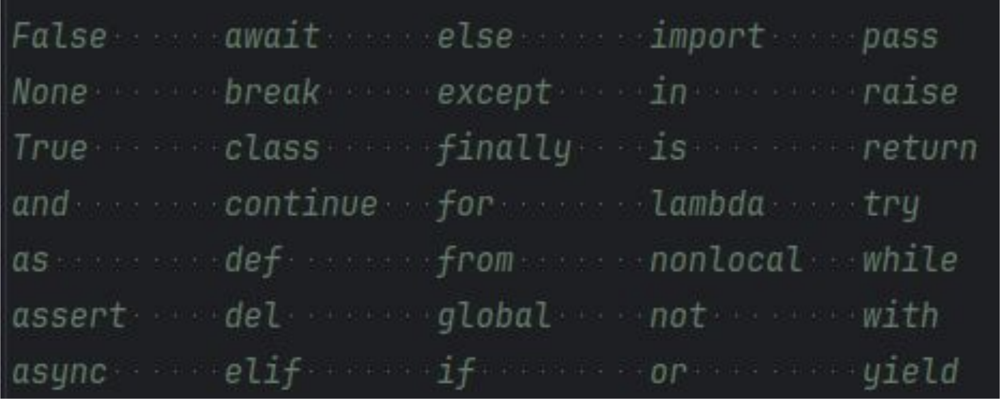

<h1>  Aula do dia 16 de abril de 2024 </h1>

<h2> snake_case </h2> 
Usado para nome de variáveis
<br>Letras minúsculas, separando palavras com ‘_’

```
user_name = "Kauã Castanho""
total_amount = 1000
```
<h2> CamelCase </h2> 
<br> Usado para nomes de classes

```
class user: pass
```
Constantes: letras maiúsculas, com ‘_’ separando palavras
```
MAX_VALUE = 100
PI_VALUE = 3,14
```
**Observação: Não há definição real de constante em Python**
````
MAX_VALUE = 100
print(MAX_VALUE)
MAX_VALUE = 200
PRINT(MAX_VALUE)
````
<h2> Palavras reservadas </h2>
- Não nomeie variáveis usando estas palavras
<br> - Estes termos possuem significado próprio no Python

<br>

<h1> Tipos de Dados </h1>

<h2> 1- Type  </h2>
Use o método para confirmar o tipo de uma variável

```
>>> age = 25
>>> print(type(age))
‹class 'int'>
>>> name = 'Matheus'
>>› print(type(name))
<class 'str'>
```

<h2> 2- bool: True ou False (CamelCase) </h2>

```
>>> a=1
>>> b=2
>>> a==b
False
```
```
>>> bool('a')
True
False
>>> bool(0)
False
>>> bool (1)
True
```
<h2> 3- None </h2>
Representa a ausência de informação
<br> Algumas linguagens usam o termo null

````
>>> bool(None)
False
````
````
>>› a = None
>>> bool(a)
False
>>> a==False
False
````
```
>>> a==True
False
>>> ล==0
False
```

<h2> 4- String </h2>
str: Conjunto de caracteres.
<br> Ex: "hello", 'world', "123".

```
>>> type('abc')
<class 'str'>
>>> type('a')
<class 'str'>
>>> type('abc' [o])
<class 'str'>
```
Podem usar aspas triplas para textos em múltiplas linhas

````
>>> a = """Lorem ipsum dolor sit amet,
..
consectetur
adipiscing
elit,
...
sed
do
eiusmod
tempor
incididunt
...
ut
labore
et
dolore
magna aliqua.
1.11 H
>>> print(a)
Lorem ipsum dolor sit amet, consectetur adipiscing elit,
sed do eiusmod tempor incididunt ut labore et dolore magna aliqua.
````
Para usar aspas como parte de uma string, podemos:
- Alternar entre “ ” e ‘ ’
- Preceder os símbolos com \ (escape/escapar a string)
````
>>> 'Usando "aspas duplas" em uma
string'
'Usando "aspas duplas" em uma string'
>>> "Usando 'aspas
simples' em uma
string"
"Usando 'aspas simples'
em uma
string"
>>> "Usando \"aspas\"
em uma string"
'Usando "aspas" em uma string'
````

<h2> 5- Lista </h2>
Coleção mutável e ordenada de itens.

````
>>> a = [1, 2, 31
>>> b = L'a', 'b', 'c']
>>> c = [None, None]
>>> d=a +
b
+
C
>>> d
[1, 2, 3, 'a', 'b', 'c', None, Nonel
>>> d[6] = 'python'
>>> d
[1, 2, 3, 'a', 'b', 'c', 'python', Nonel
````

<h2> 6- Tupla </h2>
Coleção imutável e ordenada de itens

```
>>>
a = (1,
2,
3)
>>> b = ('a', 'b', 'c')
>>> c = (None, None)
>>> d= a + b
+ C
>>> d
(1, 2, 3, 'a', 'b', 'c', None, None)
>>> d[6] = 'python'
```

<h2> 7- Dicionário </h2>
Conjunto mutável de pares chave-valor

```
>>> a = {'name': 'Matheus', 'city': 'Porto Alegre'}
>>>
>>> a = {'name':
'Matheus', 'city':
'Porto Alegre'}
>>> a['status'] = 'active'
>>> a
{'name': 'Matheus', 'city': 'Porto Alegre', 'status': 'active'}
>>> del al'city']
>>> al'status'] = 'inactive'
>>> a
{'name': 'Matheus', 'status': 'inactive'}
```
<h1> Operadores matemáticos </h1>

```
a = 10
b = 3
```

<h2> Adição <h2>

```
print (a + b) #• Output: 13
```

<h2> Subtração </h2>

```
print(a - b) # Output: 7 
```

<h2> Multiplicação </h2>

```
print (a * b) # Output: 30 
```

<h2> Divisão </h2>

```
print(a /b) # Output: 3.33333333335
```

<h2> Floor Division: (div)</h2>

```
print(a //b) # Output: 3
```

<h2> Modulus (mod): </h2>

```
print (a % b) # Output: 1
```

<h2> Exponentiation: ** </h2>

```
print (a ** b) # Output: 1000
```

<h1> Desafio calcular hipotenusa, área e perímetro </h1>

````
kauacastanho@neymar-jr ~ % python3 calculadora.py
Digite a altura: 2
Digite a largura: 4
A área do retangulo é:  8
O perímetro do retangulo é:  16
A hipotenusa é:  4.47213595499958
kauacastanho@neymar-jr ~ % nano calculadora.py   
kauacastanho@neymar-jr ~ % nano calculadora.py   
kauacastanho@neymar-jr ~ % 
kauacastanho@neymar-jr ~ % python3 calculadora.py
Digite a altura: 5 
Digite a largura: 10
A área do retangulo é:  50
O perímetro do retangulo é:  30
A hipotenusa é:  11.180339887498949
kauacastanho@neymar-jr ~ % 
````