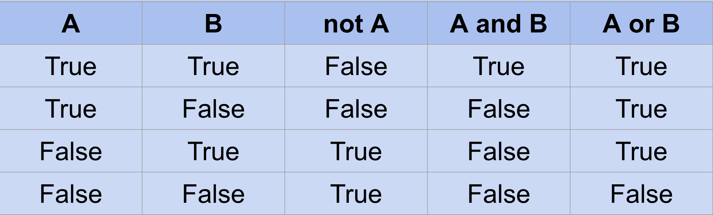

<h1>  Operadores lógicos e condições </h1>



<h2> Comentários</h2>  
Usar # na frente do comentário 
<br>
ex:

````
#comentário 
````
<br> 

<h2> Operadores lógicos: precedências </h2>
 Operações são executadas nesta ordem:

 - Parênteses mais internos
 - not
 - and
 - or


<br>

<h2> Operadores relacionais </h2>
Representam relação entre duas variáveis

 - **Igual a** (==)
 - **Diferente de** (!=)
 - **Maior que** (>)
 - **Menor que** (<)
 - **Maior ou igual a** (>=)
 - **Menor ou igual a** (<=)

<br>

<h2> Comandos condicionais: if </h2>
Executa um bloco de código apenas se a condição for verdadeira.
<br>Estrutura básica:

<br>

````
condition = True

print("before 'if'")

if condition:
    print ("condition == True")

print("after 'if'")
````
<br>

<h2> Comandos condicionais: if-else </h2>
Executa o primeiro bloco de código se a condição for verdadeira, do contrário executa o segundo bloco.
<br>Estrutura básica:

<br>

````
X = 3

if x % 2 == 0:
    print("x é par")
else:
    print("x é impar")
````


<h2> Comandos condicionais: if-elif-else </h2>
Possibilita avaliar múltiplas condições, executando o primeiro bloco onde a condição for verdadeira. Caso nenhum bloco for verdadeiro, executa o bloco do else.

<br>

````
X = -42

if x > 0:
    print("x é positivo")
elif x < 0:
    print("x é negativo")
else:
    print("x é zero")
````


<h2> Comandos condicionais: match-case </h2> 

- Possibilita fazer múltiplos ‘if’s de forma menos verbosa.
- O mesmo pode ser escrito com múltiplos ‘ifs’
- É um ‘syntactic sugar’
- Adicionado ao Python 3.10. 
- Conhecido como switch em outras linguagens.

<br>

````
    match operacao:
        case '+':
            print (x +y)

        case '-':
            print (x - y)

        case '*':
            print (x * y)
        
        case '/':
            if y != 0:
                print (x / y)
            else:
                print("Erro: Divisão por zero")

        case_:
            print("Operador invalido")
````


<h2> Atividade: Ano bissexto </h2>
Solicite ao usuário um ano e imprima se o ano digitado é bissexto ou não. Caso o ano digitado não for bissexto, imprima também o próximo ano que será.

<br>

````
ano = int(input("Digite um ano: "))


if ano % 4 == 0:
    print("Este ano é um ano bissexto")

else:
    ano = ano +(4 - ano % 4)
    print("o próximo ano bissexto será", ano)
````

<h2> Atividade: Horóscopo do programador </h2>
É de conhecimento geral que quando nasce um programador lhe é atribuído um signo de programador. Solicite ao usuário o mês de seu nascimento e imprima o signo respectivo:

<br> 

```
print("Digite o mês de nascimento em número inteiro: ")
mes = int(input("Digite um mês: "))

if mes < 1 or mes > 12:
    print("Você não é um programador")

match mes: 
    case 1:
        print("Python")
    
    case 2:
        print("Fortran")
    
    case 3:
        print("Rust")
    
    case 4:
        print("Go")
    
    case 5:
        print("Java")
    
    case 6:
        print("JavaScript")
    
    case 7:
        print("C")
    
    case 8:
        print("PHP")
    
    case 9:
        print("Haskell")
    
    case 10:
        print("Perl")
    
    case 11:
        print("Swift")
    
    case 12:
        print("Kotlin")
```

<h2> Atividade: Censo brasileiro </h2>

````
ANO_ATUAL = 2025

ano_nascim = int(input("Digite seu ano de nascimento: "))

estudante = input("Você estuda? (Responda 's'para sim ou 'n'para não) ")

trabalha = input("Você trabalha? (Responda 's'para sim ou 'n'para não) ")

aposent = input("Você é aposentado? (Responda 's'para sim ou 'n'para não) ")

idade = ANO_ATUAL - ano_nascim

if ano_nascim < 1 or ano_nascim > 2025 or ano_nascim < 1875:
    print("Cadastro reprovado!")

elif trabalha == 's' and aposent == 'n':
    regim = input("Qual o regime? (mei, estag, outro) ")
    renda = float(input("Qual é a sua renda mensal, (ignore os centavos)? "))

    if regim == 'mei' and renda > 6750:
        print("Cadastro reprovado!")
    elif renda < 0:
        print("Cadastro reprovado!")

    elif regim == 'estag' and estudante == 'n':
        print("Cadastro reprovado!")

    elif regim == 'estag' and estudante == 's':
        print("Cadastro aprovado!")

elif aposent == 's' and idade < 62:
    print("Aprovado com ressalvas!")

elif aposent == 's' and idade > 61:
    print("Cadastro aprovado!")

elif idade < 14 and estudante == 'n':
    print("Aprovado com ressalvas!")

    if idade < 14 and trabalha == 's':
        print("Cadastro reprovado!")

    elif idade > 13 and idade < 17 and trabalha == 's' and estudante == 's':
        print("Aprovado com ressalvas!")

elif idade < 0 or idade > 150:
    print("Cadastro reprovado!")

else:
    print("Cadastro aprovado!")
````