<h1> Listas, tuplas e laços de repetição </h1>

<h2> Comando 'dir' </h2>
Dica: Use o método dir() para listar as variáveis disponíveis.

<br>

```
>>> a = 1
>>> b = 2
>>> U = "Matheus"
>>> dirO
['__annotations_-__builtins_-_docLoader_.-_name.-_package._spec, 'a', 'b', 'u'J
```

E dir(variável) para listar os métodos disponíveis nesta variável.


````
>>> dir(u)
['__add__', ' __class__ , '__contains__',iideLattr_-__dir-_doc__-__format.__ge____getattribute__''__getitem__', '__getnewargs_', '-_getstate_', '__gt__hash_', '-init-init_subclass_', '_iter__', '__le__', '__len_, '__It__', '__mod_.-_mul_.', '__ne_-',-_new__''__reduce_.'_reduce_ex_', '__repr__', '_rmod_', '._rmul.-', '__setattr___sizeof__',__str__','__subclasshook_-capitalize', 'casefold', 'center', 'count', 'encode', 'endswith', 'expandtabs''find','format', 'format_map, 'index', 'isalnum' , 'isalpha', 'isascii', 'isdecimal', 'isdigit','isidentifier', 'islower', 'isnumeric', 'isp rintable', 'isspace', 'istitle', 'isupper', 'join''just', 'lower', 'lstrip', 'maketrans', 'partition', 'remov
````

<h1> Listas </h1> 

Listas são coleções mutáveis e ordenadas de itens heterogêneos.

- Mutável: adicione, remova ou substitua itens da lista
- Ordenada: acesse os itens através de um índice (0-based), sem percorrer toda a lista
- Itens heterogêneos: armazena números, strings, listas, tuplas…

<br>
<h2> MUTÁVEL</h2>

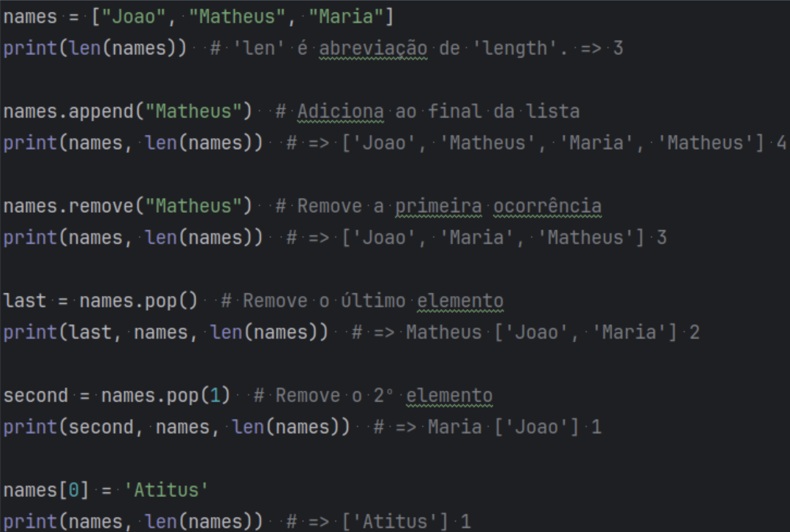

<br>

<h2> ORDENADA </h2>

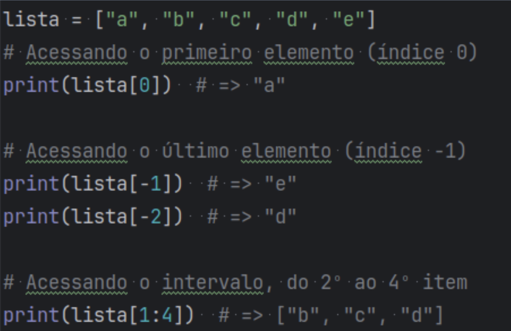

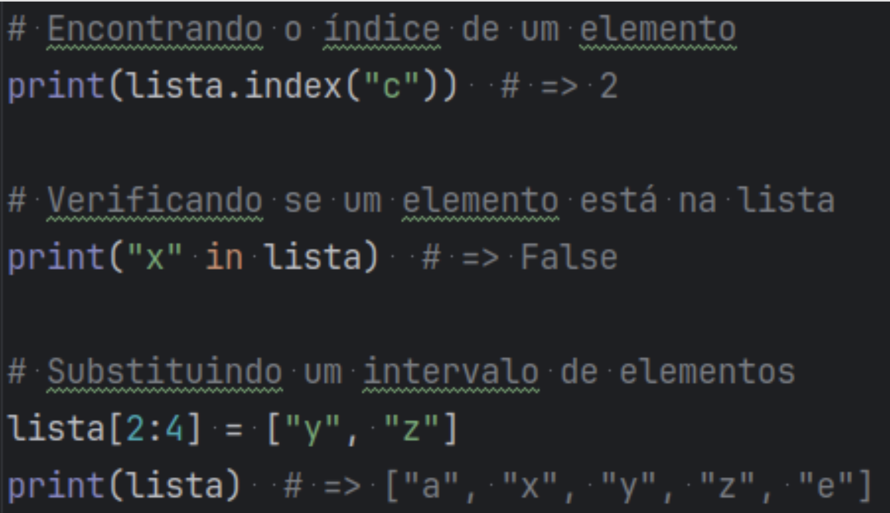

<br>

<h2> HETEROGÊNEA </h2>

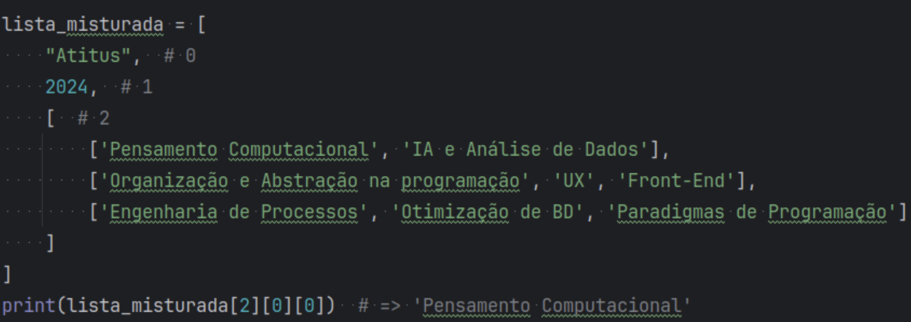


<h2>  TUPLAS </h2>
Tuplas são coleções imutáveis e ordenadas de itens heterogêneos.

- Imutável: tupla não pode ser alterada após sua criação.

<br>

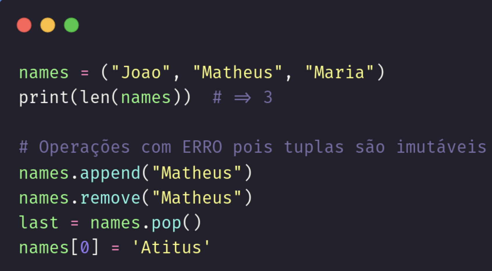

<br>

<h2> ORDENADA</h2>

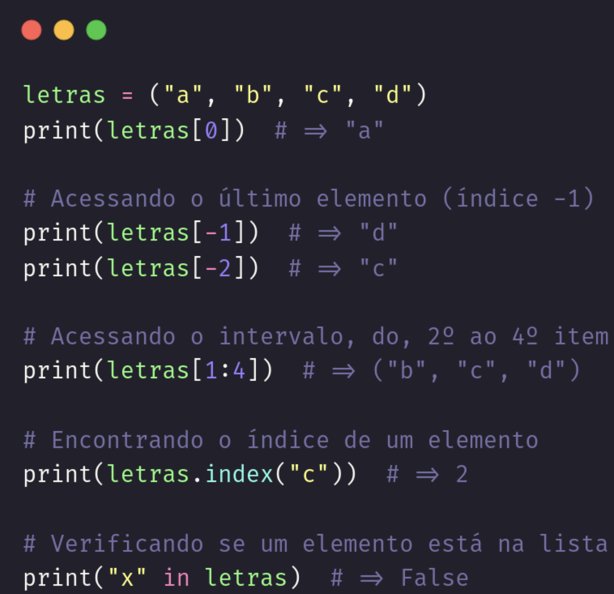

<br>

<h2> HETEROGÊNEA </h2>

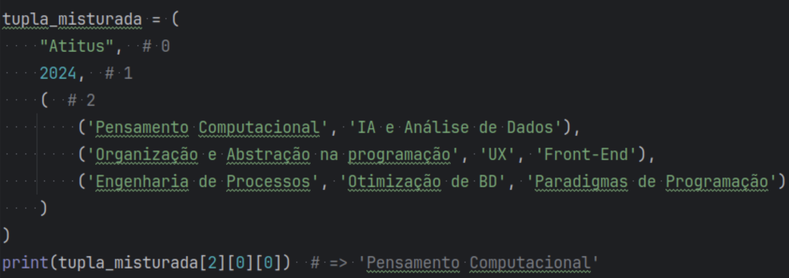

<br>
<br>

<h2> Laços de repetição: for </h2>

Altera por uma lista de itens, executando o mesmo trecho de código para cada elemento.

<br>

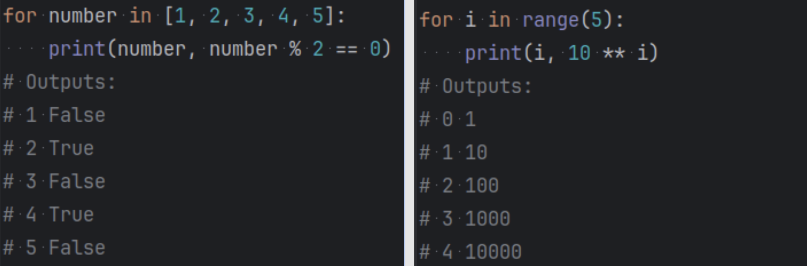

<br>
<br>

<h2> Laços de repetição: while </h2>

Executa um trecho enquanto a condição for verdadeira

<br>

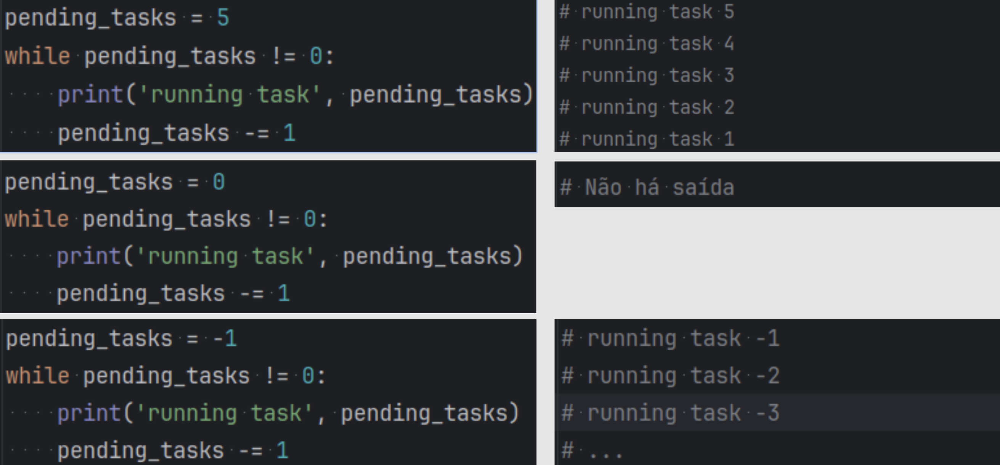

<br>
<br>

<h2> Laços de repetição: list comprehension </h2>

Syntactic sugar similar ao ‘if ternário’, possibilitando operações com listas em uma única linha.

<br>

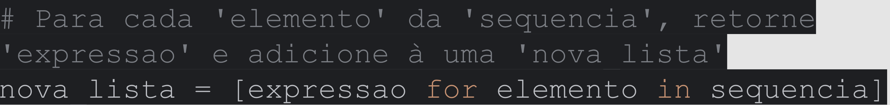

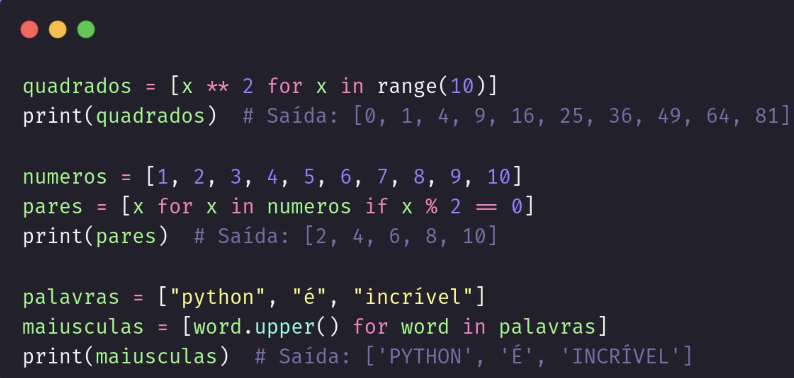
<br>
<br>

<h1> ATIVIDADES </h1>

- Fatorial

<br>

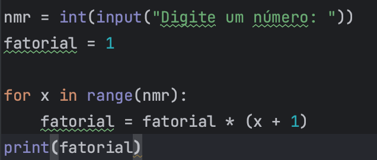

<br>

- Imprime losango

<br>


