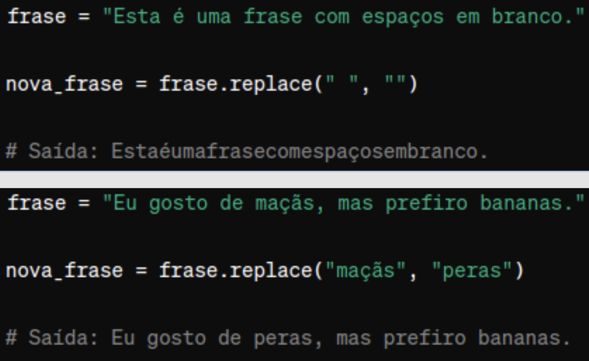
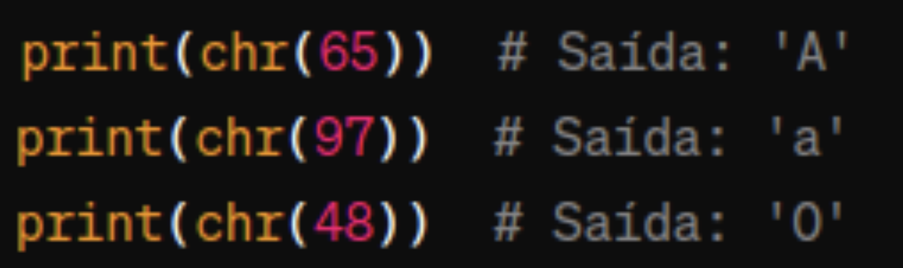

<h1> Strings e Random </h1>

<br>
<br>
<br>
<br>

<h2> Operações: concatenação </h2>

<br>

- Une duas (ou mais) strings em uma nova variável. 
Não há alteração de strings, str1 e str2 são copiadas em uma nova string.

<br>


<br>
<br>

<h1> Operações: Interpolation </h2>

- Interpolação de strings, também chamado de ‘f-strings’.

<br>


<br>
<br>

<h1> Operações: split </h1>

- Split: divide a string em uma lista de strings, usando o parâmetro como divisor

<br>


<br>
<br>

<h1> Operações: slice </h1>

- Slice: fatia a string conforme os índices informados 


Operação de slice recebe até 3 parâmetros:
	minha_string[start:stop:step]
start: índice do início da fatia
stop: índice do final da fatia
step: ‘passo’ na fatia

````
text = ‘Luz azul’
print(text[::2]) #Lzau
print(text[::-1]) #luza zuL

````

<br>

<h1> Operações: join </h1>

- Une os elementos de uma lista, usando uma string como separador.

<br>


<br>
<br>

<h1> Operações: replace </h1>

- Substitui ocorrências de uma string por outra string.

<br>



<br>
<br>

<h1> Operações: find </h1>

- Procura por uma substring dentro da string. Retorna o índice da primeira ocorrência ou -1 se não encontrar

<br>


<br>
<br>

<h1> Operações: upper, lower e capitalize </h1>


<br>
<br>

<h1> ASCII </h1>

- American Standard Code for Information Interchange representa os caracteres alfabéticos, numéricos, pontuação e símbolos. 

- Desenvolvido nos anos 60 e padronizado em 1963 pela ANSI (American National Standards Institute).

Consiste em 128 caracteres (de 0 a 127). 

Exemplos: 
- Letras maiúsculas: A-Z (65-90)
- Letras minúsculas: a-z (97-122)
- Números: 0-9 (48-57)

Limitações:
- Falta de suporte para caracteres acentuados
- caracteres não alfabéticos usados em outros idiomas
- caracteres especiais. 

Para superar essas limitações, foram desenvolvidas extensões do ASCII, como o ISO 8859 e o UTF-8

<br>
<br>

<h1> ASCII: ord e chr </h1>

<h2> ord() </h2> 

- Retorna o código ASCII de um caractere


<h2> chr() </h2> 

- retorna o caractere correspondente a um número (código ASCII)




<h1> Geração de dados pseudoaleatórios </h1>

- Pesquisar: por que chamamos de ‘pseudoaleatórios’? Não poderiam ser apenas ‘aleatórios’?


