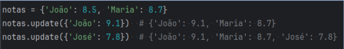

<h1> Dicionários </h1>

 
 

<h2> Definição </h2>

Estrutura de dados que armazena uma coleção de pares de chaves (key) para valores (value). 

Cada chave é única e associada a um valor específico. 

Os valores podem ser de qualquer tipo, como strings, inteiros, listas, tuplas e até mesmo outros dicionários.

 
 

<h2> Criação </h2>

 
 

<h2> Acesso aos dados </h2>

 
 

<h2> Modificação de valores </h2>

Use a chave para atribuir um novo valor

 
 

<h2> Adição de atributos </h2>

Assim como em atribuição de valor, use o acesso indexado para adicionar um novo par chave-valor.

 
 

<h2> Remoção de atributos </h2>

Comandos: 

- del apenas remove a chave (sem retornar)
- pop remove a chave e retorna o valor

 
 

<h2> Iteração </h2>

 
 

<h2> Verificar chaves </h2>

 
 

<h2> Atualizando dados </h2>

Atualiza uma chave existente ou adiciona o chave-valor caso não exista.

 
 

<h2> Dictionary comprehensions </h2>

Syntactic sugar para criação de dicionários (similar ao que vimos em list comprehensions)

 
 

