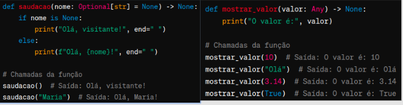

<h1> Introdução à Funções </h1>

<h2> Definição </h2>

Uma função é um bloco de código reutilizável e autocontido que executa uma tarefa específica. 
Segue o formato:

<h2> Parâmetros e Argumentos </h2>

Chamamos de parâmetros os valores que a função recebe na sua definição (parametro1 e parametro2)
Quando executamos a função, chamamos esses valores de argumentos.

<h2> Parâmetros Posicionais </h2>

Os argumentos são correspondidos com os parâmetros na ordem em que são definidos na função.

<h2> Parâmetros Nomeados </h2>

Também chamados de parâmetros por palavra-chave, permitem uma ordem arbitrária dos argumentos.

<h2> Parâmetros com Valor Padrão </h2>

Se nenhum argumento for informado durante a chamada da função, os valores padrão (default) serão usados.

<h2> Escopo Local de Variáveis </h2>

Variáveis definidas dentro de uma função têm um escopo local: só podem ser acessadas dentro dessa função. 

<h2> Escopo Global de Variáveis </h2>

Variáveis definidas fora de funções têm escopo global: 
- podem ser acessadas de qualquer 
- lugar, incluindo dentro de funções. 

Se você atribuir um valor a uma variável global dentro de uma função, você precisa declará-la como global:

EVITE o uso deste recurso.

<h2> Tipagem de Parâmetros </h2>

Python é dinamicamente tipado: não é necessário declarar explicitamente os tipos de dados das variáveis. 

Isso proporciona flexibilidade, mas também pode levar a erros difíceis de rastrear se tipos de dados inesperados forem passados para uma função.

Python >= 3.5 suporta anotações de tipo, permitindo que você especifique os tipos dos parâmetros e o tipo do retorno da função. 

São anotações opcionais e não têm impacto no comportamento do programa em tempo de execução, mas podem ser úteis para documentação e ferramentas de verificação de tipo (e.g. autocomplete da IDE).

int (inteiro), float (número decimal), complex: (número complexo)
str (string), list, tuple, range (sequência de números)
dict (dicionário)
set (conjunto)
bool (booleano)

Union (um dos tipos especificados)
Classes (assunto do 2º semestre)

None, any (qualquer tipo)
Optional (tipo especificado ou None)

<h2> Lambda (funções anônimas) </h2>

Uma função é um bloco de código reutilizável e autocontido que executa uma tarefa específica. 

