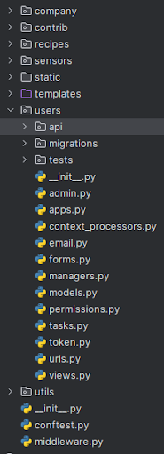
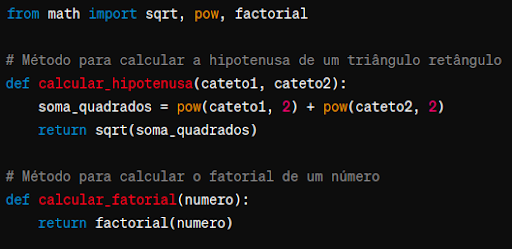
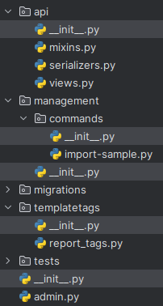
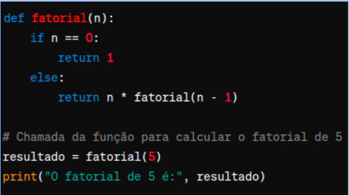
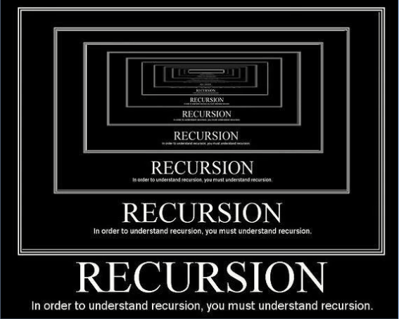
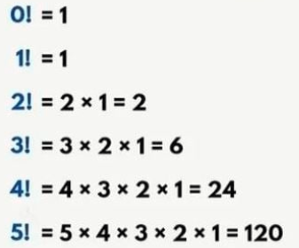
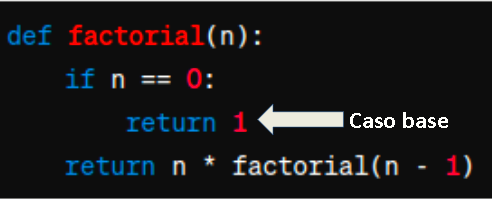

<h1>  Funções built-in e uso de import </h1>

 
 

<h2> Comando import: motivação </h2>

Conforme programas ganham mais complexidade e 
funcionalidades, se torna necessário separar métodos em 
múltiplos arquivos.

Entre os benefícios, podemos citar:

- Organização e Legibilidade: o código se torna mais organizado e legível. Agrupe funcionalidades relacionadas para facilitar a compreensão do projeto.

 

Benefícios (continuação):

- Reutilização de Código: possibilita reutilizar funcionalidades em diferentes partes do seu projeto ou até mesmo em projetos diferentes.
- Colaboração: permite que membros da equipe trabalhem em diferentes partes do código simultaneamente, sem interferir uns com os outros.
- Facilidade de Teste e Depuração: facilita os testes e a depuração (debug), pois você pode isolar e testar cada parte independentemente. 
- Desempenho: Em alguns casos, pode melhorar o desempenho do programa. Isso ocorre porque apenas as partes do código relevantes são carregadas na memória quando necessário.

 
 

<h2> Import </h2>

Comando usado para carregar módulos de outros arquivos. 

 

 
 

<h2> Arquivo __init__.py </h2>

O arquivo __init__.py é um arquivo especial em Python 
que indica ao interpretador que a pasta contendo este 
arquivo é um pacote Python (package). 

O __init__.py pode estar vazio ou conter inicialização 
do pacote.

É um arquivo obrigatório para que o Python reconheça 
a pasta como um pacote e permita a importação 
de módulos dele.

 

 
 

<h2> Funções: recursividade </h2>

Funções podem executar outras funções ou chamar a elas mesmas. Quando isso ocorre,chamamos de recursividade.

Recursividade SEMPRE 
possui um caso base 
que termina a recursão

 

 

 

Exemplo de recursividade: Fatorial

Exercício: use recursividade para calcular o fatorial

 

 

Exemplo de recursividade: Fatorial

Comentem: E n for um número negativo?

 

