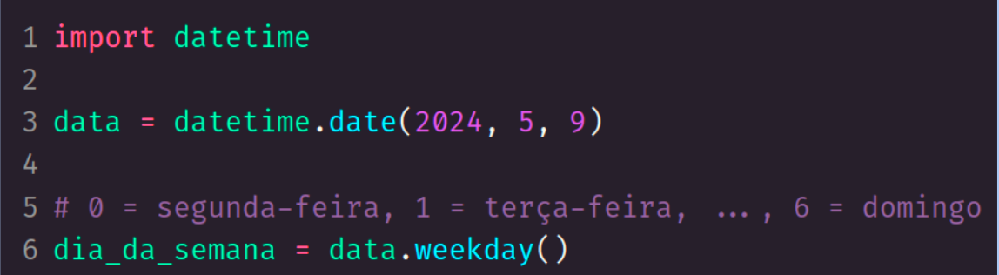

<h1> Manipulação de datas <h1>

 
 

<h2> Representar tempo em memória <h2>

‘Epoch’ é uma forma de representar o tempo usando um ponto de referência a partir do qual são calculadas outras datas. 

Este ponto é representado como ‘zero’ e contamos o tempo em mili/segundos a partir desse ponto. 

 
 

<h2> Epoch <h2>

Existem alguns padrões e o Python automatiza a conversão entre eles.

- Unix Epoch: utilizado em sistemas Unix, define o início do tempo como 00:00:00 UTC de 1/Jan/1970.
 
- Windows Epoch: (ou "FileTime Epoch") utilizado no Windows, é definido como 00:00:00 UTC em 1/Jan/1601.

 
 

<h2> Data atual em relação ao Epoch <h2>

 
 

 
 

<h2> Gerar data a partir de float (epoch) <h2>

Chamamos de timestamp a representação de um ponto específico no tempo, geralmente expressa como o número de segundos (ou milissegundos) decorridos desde o epoch.

 
 

 
 

<h2> Criando datas <h2>

 
 

 
 

<h2> Operando com datas <h2>

 
 

 
 

<h2> Formatando datas para string <h2>

A formatação de datas para string segue um formato padrão original da linguagem C. 

- Tabela de referência oficial:
  https://docs.python.org/3/library/datetime.html#strftime-and-strptime-format-codes
  
- Tabela com exemplos: 
  https://strftime.org/

 
 

 
 

 
 

<h2> Formatando string para data <h2>

 
 

 
 

<h2> Dia da semana <h2>

 
 

