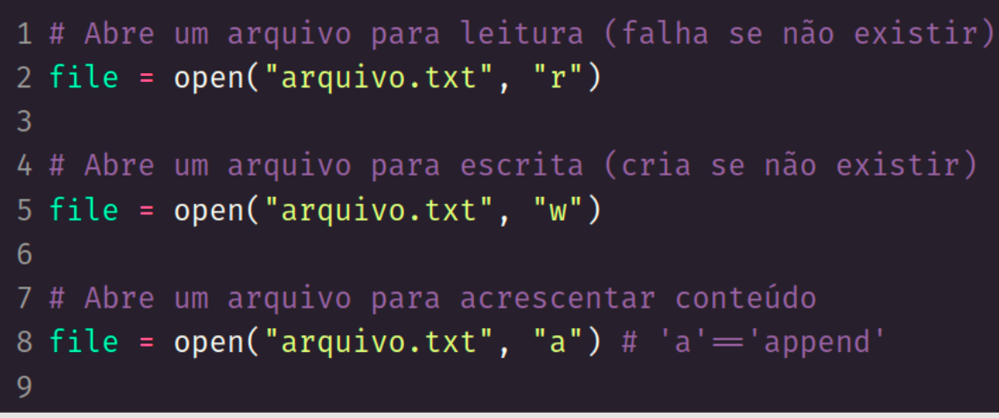
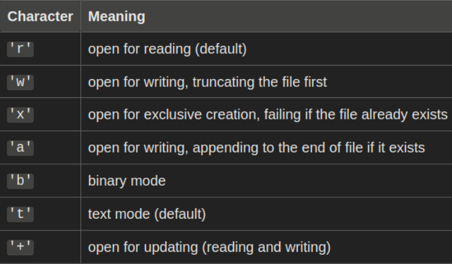
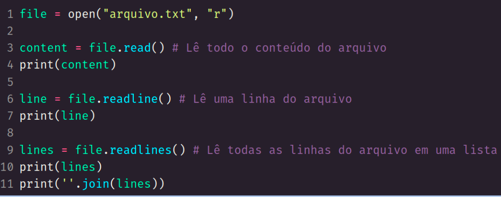
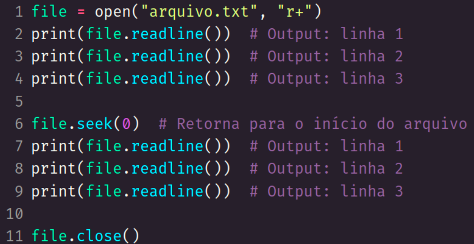
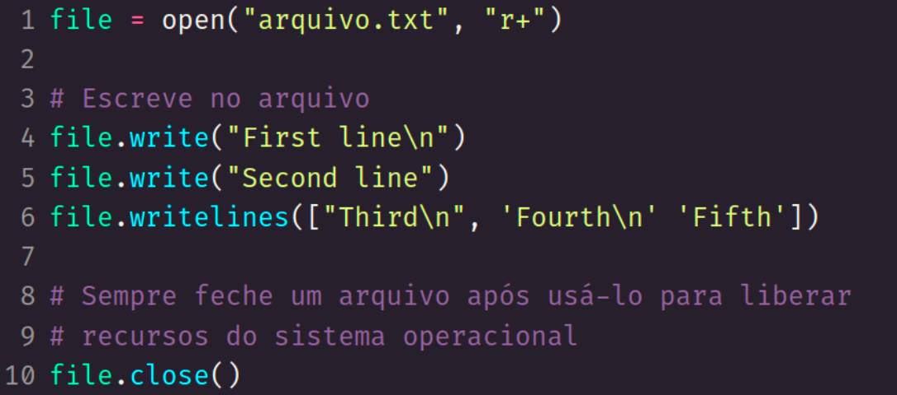
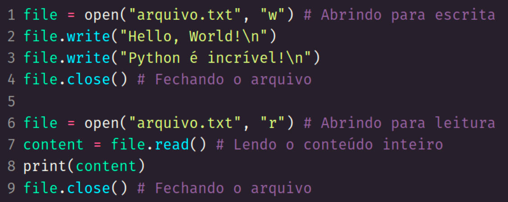
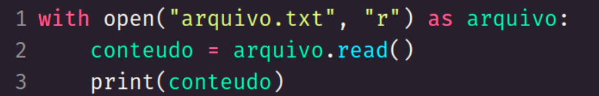
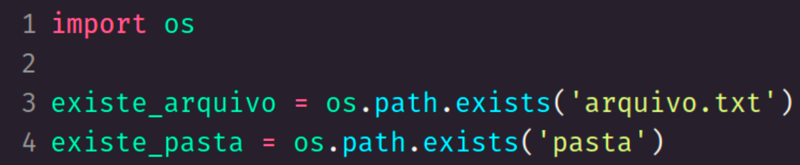
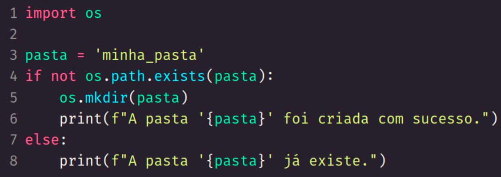

<h1> Manipulação de arquivos <h1>

 
 

<h2> Criar arquivos <h2>

 
 

 
 

<h2> Criar arquivos: modos de abertura <h2>

 
 

 
 

https://docs.python.org/3/library/functions.html#open

 
 

<h2> Ler arquivos <h2>

 
 

 
 

<h2> Quebra de linha <h2>

 
 

'''
    
    Refere-se ao caractere ou caracteres usados para indicar o final de uma linha de texto.

    Em Linux e macOS o '\n' faz a quebra de linha.
    No Windows ocorre com o caractere de retorno de carro '\r' seguido da nova linha '\n' ('\r\n')

    read() e readline() retorna o conteúdo incluindo os caracteres de quebra de linha
'''

 
 

<h2> Ler arquivos <h2>

 
 

 
 

<h2> Alterar arquivos <h2>

 
 

 
 

<h2> Exemplo completo <h2>

 
 

 
 

<h2> Bloco with <h2>

 
 

'''
    Garante que a Garbage Collection ocorra para o arquivo assim que o bloco terminar. 
    Dispensa a necessidade do close()
    Pode ser utilizado com outros recursos, como conexão com DB.

'''

 
 

 
 

<h2> Verificar existência <h2>

 
 

'''
    Retorna um bool informando se o arquivo (ou pasta) existe.
'''

 
 

 
 

<h2> Criação de pasta <h2>

 
 

'''
    Cria a pasta com o nome informado ou falha se já existir
'''

 
 

