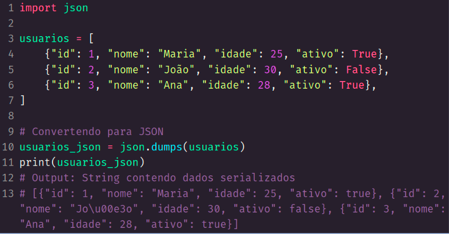
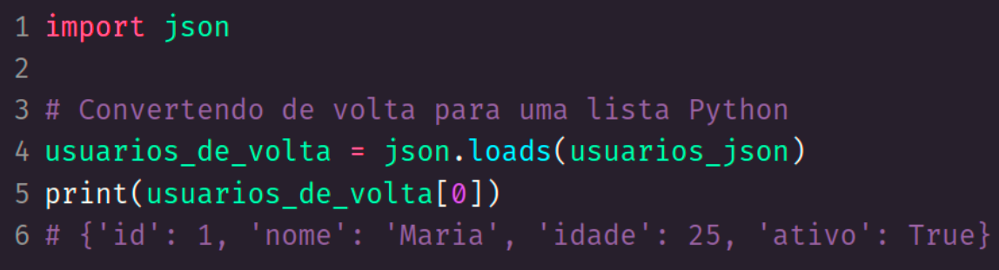

<h1> serialização com JSON, XML e CSV </h1>

 
 

<h2> Application Programming Interface </h2>

'''

    API é um conjunto de regras que permitem que diferentes softwares se comuniquem entre si. 

    Permite (por exemplo) que um app de celular envie e receba informações para um servidor. 

    Chamamos essa capacidade de interoperabilidade entre diferentes sistemas. 
'''

 
 

<h2> Serialização </h2>

'''

    Processo de converter uma estrutura de dados em um formato que pode ser facilmente armazenado ou transmitido e posteriormente reconstruído. 

    Esse formato pode ser via texto ou em bytes. 

    A deserialização é o processo inverso, onde os dados serializados são convertidos de volta para o objeto original.

'''

 
 

<h2> XML (eXtensible Markup Language): </h2>

'''

    Bastante popular e presente em muitos sistemas antigos
    Mais verbosa que alternativas
    Pode conter comentários no conteúdo

'''

 
 

 
 

<h2> XML </h2>

 
 

 
 

<h2> YAML (Yet Another Markup Language): </h2>

'''

    Possibilita comentários
    Pouco comum no uso de transmissão de dados entre sistemas (muito popular para armazenar configurações de aplicações)
    Fácil leitura e depende de identação (assim como Python)

'''

 
 

 
 

<h2> JavaScript Object Notation (JSON) </h2>

'''

    Fácil leitura e não verboso (reduz quantidade de dados enviados)
    Amplamente utilizado na indústria para transmissão de dados entre sistemas
    Não oferece comentários nativamente (possível através de campos string)

'''

 
 

 
 

<h2> Comma-Separated Values (CSV) </h2>

'''

    Formato simples e não proprietário (alternativa ao Excel), utilizado para armazenar dados tabulares em texto. 

    Não é utilizado para transmitir dados entre aplicações, mas é útil para geração de relatórios
    Não consegue armazenar dados complexos
    Não pode conter comentários

'''

 
 

 
 

<h2> Serializando dados </h2>

 
 

 
 

<h2> Deserializando dados </h2>

 
 

