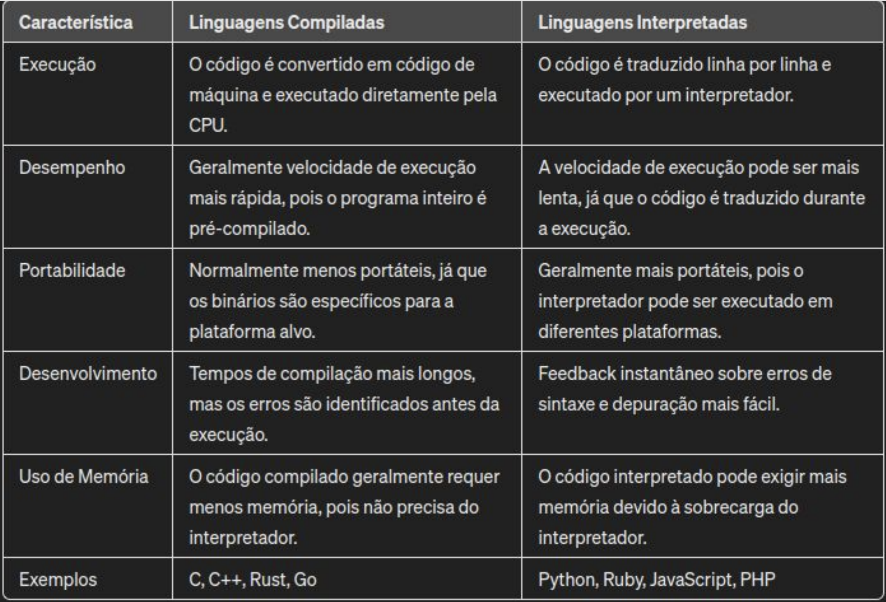

# segunda_aula

*Aula do dia 15.04.2024*

linguagens de alto nivel
-Mais próximos da linguagem humana
-O mesmo codigo executa em diferentes hardwares
-Python, Java, C#, JavaScript, Ruby

Linguagens de baixo nivel
-Masi proximos da linguagem da maquina (mais dificil de entender a sintaxe)
-Sao dependentes do hardware progrmado
-Oferecem um maior controle sobre os recursos de baixo nivel (memoria, processador)
-Muito desempenho
-Assembly

Linguagens de proposito geral
-Uma ampla variedade de aplicacao
-Masi versateis
-Mais usuarios(programadores)
-Python, JavaScript e Ruby.

Linguagens de dominio especifico
-Também chamadas de DSL (Domain Specific Languages) 
-Resolvem problemas em um dominio particular
-Otimizadas para lidar com tarefas especificas dentro de uma area especifica
Frequentemente combinadas com linguagens de propósito geral
-SQL (banco de dados), HTML/CSS (desenvolvimento
-web), MATLAB (computação numérica) e VHDL (design de circuitos).

Compilacao ou interpretacao

